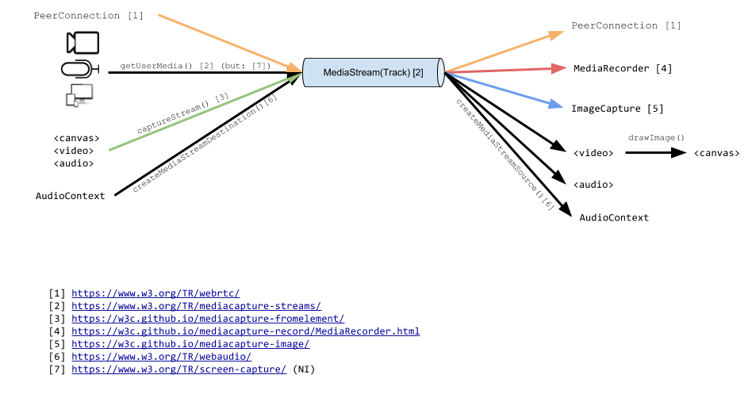

# Streams-MediaStreamTrack API Specification

This is the repository for `stream-mediastreamtrack`, an experimental API for generating [`Streams`](https://streams.spec.whatwg.org/#stream) out of a [`MediaStreamTrack`](https://www.w3.org/TR/mediacapture-streams/#mediastreamtrack).

You're welcome to contribute! Let's make the Web rock our socks off!

## Introduction

[`Streams`](https://streams.spec.whatwg.org/#stream) are designed to provide real time streams of data with powerful semantics (e.g. built-in backpressure and queuing) to allow users to build higher-level abstractions.

[`MediaStreamTracks`](https://www.w3.org/TR/mediacapture-streams/#mediastreamtrack) are opaque handles to Real-Time video/audio being transported in the browser. This media is produced or consumed via Sources and Sinks offered by the platform and represented in the following diagram



Source/sink functionality not supported in this diagram forces users to resort to contortions such as reflexion on intermediate HTML elements (e.g. `<canvas>`, see [the Workarounds Section](#current-related-efforts-and-workarounds-wrench)) or offline processing (e.g. using [`MediaRecorder`](https://w3c.github.io/mediacapture-record/MediaRecorder.html)).  These approaches, however, lose the timing information, introduce friction in the interoperability.

This situation is made only more evident with the arrival of powerful programmable environments such as [WebAssembly](http://webassembly.org/) where users will naturally expect to be able to manipulate Real-Time media.

## Use cases

Use cases that depend explicitly on timing are enabled, e.g.:

- Measuring the amount of Video Frames produced; calculating the source frame rate.
- Calculating inter-frame measures, e.g. motion flow, presence/absence, stabilization,
- Adding subtitles to Video/Audio.

Whereas use cases that do not depend explicitly on timing are not enabled but are enhanced:

- Producing per-frame analysis and transformations, e.g. average brightness and an endless array of digital image processing algorithms.
- Adjusting the presentation timestamp of the media to speed up or slow down a video, hence creating a slow-motion or timelapse effect.

### Possible future use cases ?

Making a `MediaStreamTrack` both a `ReadableStream` and a `WritableStream` (i.e. a `TransformStream`) would allow for even more sophisticated use cases where users could 'plug' custom elements in `MediaStreamTrack`-based pipelines, e.g. WebAssembly operations between WebCam capture and Recording, etc.

## Current Related Efforts and Workarounds :wrench:

The most usual hack to access Video data is to cast a given `MediaStreamTrack` onto a `<video>` element and onto a `<canvas>` in turn that is subsequently read back -- `<video>` elements provide no `drawed` event so it's up to the user to blit from `<video>` to `<canvas>` on a timely basis (see e.g. [this article](https://developer.mozilla.org/en-US/docs/Web/API/Canvas_API/Manipulating_video_using_canvas#Manipulating_the_video_frame_data)).  Moreover, usually reading from `<canvas>` implies a costly read back from GPU and potential pixel conversions needed.

Chrome [Pepper API](https://developer.chrome.com/native-client/pepper_dev) introduced and supports both [MediaStreamVideoTrack](https://developer.chrome.com/native-client/pepper_dev/cpp/classpp_1_1_media_stream_video_track) and [MediaStreamAudioTrack](https://developer.chrome.com/native-client/pepper_dev/cpp/classpp_1_1_media_stream_audio_track) addressing a similar situation as the one described here.

## Examples and demos

http://rawgit.com/yellowdoge/streams-mediastreamtrack/master/index.html#examples

## Notes on bikeshedding :bicyclist:

To compile, run:

```
curl https://api.csswg.org/bikeshed/ -F file=@index.bs -F force=1 > index.html
```

if the produced file has a strange size (i.e. zero), then something went terribly wrong; run instead

```
curl https://api.csswg.org/bikeshed/ -F file=@index.bs -F output=err
```
and try to figure out why `bikeshed` did not like the `.bs` :'(
